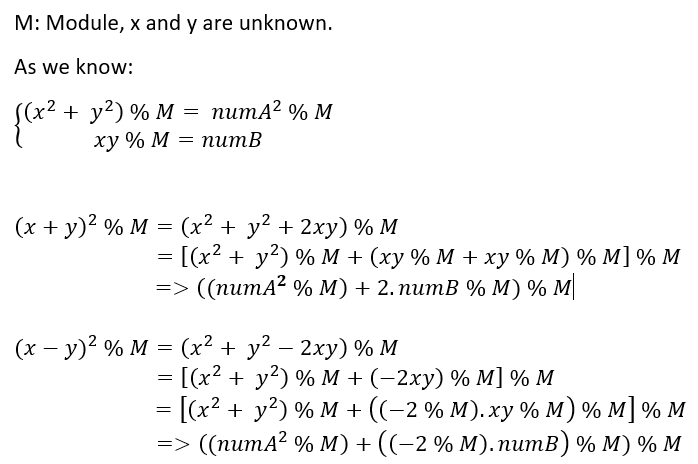

# intersection (16 solves) | Author: ptr-yudai
# Description
* Simple flag checker for warmup! No strip and no obfuscation! Only main function!

# Intro
This challenge is written by Go, then trace from line 139 to 149, there are 3 big numbers which are called : num1, num2 and mod

* Check flag
```go
        math_big___Int__Mul(v1, v2, v84, (unsigned int)v117, v37, v38, (__int64)v117, v84);
        math_big___Int__Mul(v1, v2, v39, v83, v40, v41, (__int64)v114, v83);
        math_big___Int__Add(v1, v2, v42, (unsigned int)v114, v43, v44, (__int64)v120, (__int64)v117);
        math_big___Int__Mod(v1, v2, v45, v86, v46, v47, (__int64)v120, (__int64)v120);
        math_big___Int__Mul(v1, v2, v48, v88, v49, v50, (__int64)v108, v88);
        math_big___Int__Mod(v1, v2, v51, v86, v52, v53, (__int64)v108, (__int64)v108);
        math_big___Int__Mul(v1, v2, v54, v83, v55, v56, (__int64)v111, v84);
        v71 = v86;
        math_big___Int__Mod(v1, v2, v57, v86, v58, v59, (__int64)v111, (__int64)v111);
        math_big___Int__Cmp(v1, v2, v60, v61, v62, v63, (__int64)v120);
        if ( v71 )
        {
          v68 = 0;                              // return to bad boy :(
        }
        else
        {
          math_big___Int__Cmp(v1, v2, v64, v65, v66, v67, (__int64)v111);// Check the result and input if both are equals
          v68 = 1;                              // return to good boy :)
        }
        if ( v68 )
        {
          *(_QWORD *)&v96 = &unk_4BB540;
          *((_QWORD *)&v96 + 1) = &off_4F63C0;
          fmt_Fprintln(                         // good boy
            v1,
            v2,
            v64,
            (unsigned int)&go_itab__os_File_io_Writer,
            v66,
            v67,
            (__int64)&go_itab__os_File_io_Writer,
            os_Stdout,
            (__int64)&v96,
            1LL,
            1LL,
            v79);
        }
        else
        {
          *(_QWORD *)&v95 = &unk_4BB540;
          *((_QWORD *)&v95 + 1) = &off_4F63D0;  // bad boy
          fmt_Fprintln(
            v1,
            v2,
            v64,
            (unsigned int)&go_itab__os_File_io_Writer,
            v66,
            v67,
            (__int64)&go_itab__os_File_io_Writer,
            os_Stdout,
            (__int64)&v95,
            1LL,
            1LL,
            v79);
        }
```

# Find solution
```go
math_big___Int__Mul(v1, v2, v84, (unsigned int)v117, v37, v38, (__int64)v117, v84);
math_big___Int__Mul(v1, v2, v39, v83, v40, v41, (__int64)v114, v83);
math_big___Int__Add(v1, v2, v42, (unsigned int)v114, v43, v44, (__int64)v120, (__int64)v117);
math_big___Int__Mod(v1, v2, v45, v86, v46, v47, (__int64)v120, (__int64)v120);
math_big___Int__Mul(v1, v2, v48, v88, v49, v50, (__int64)v108, v88);
math_big___Int__Mod(v1, v2, v51, v86, v52, v53, (__int64)v108, (__int64)v108);
math_big___Int__Mul(v1, v2, v54, v83, v55, v56, (__int64)v111, v84);
v71 = v86;
math_big___Int__Mod(v1, v2, v57, v86, v58, v59, (__int64)v111, (__int64)v111);
math_big___Int__Cmp(v1, v2, v60, v61, v62, v63, (__int64)v120);
```

That check can be written in python like this:
```txt
(x ** 2 + y ** 2) % M = numA ** 2 % M
x*y % M               = numB
```

* We cannot use z3 to solve this equations, because it take very long time to find a correct solution. So first, find solution of `(x + y) % M` and `(x - y) % M` from `check flag` function, after that use Z3 to find x and y which are part of flag.
`(x + y) % M` and `(x - y) % M`:



So now, we can find `(x + y) % M` and `(x - y) % M` from `(x + y) ** 2` and `(x - y) ** 2` by using this script https://gist.github.com/nakov/60d62bdf4067ea72b7832ce9f71ae079. Then use this result to make equations in z3-Solver, here is my script: 

* flag: Neko{intersection_of_x^2+y^2=a^2_and_y=b/x}

# Neko-chan UwU
