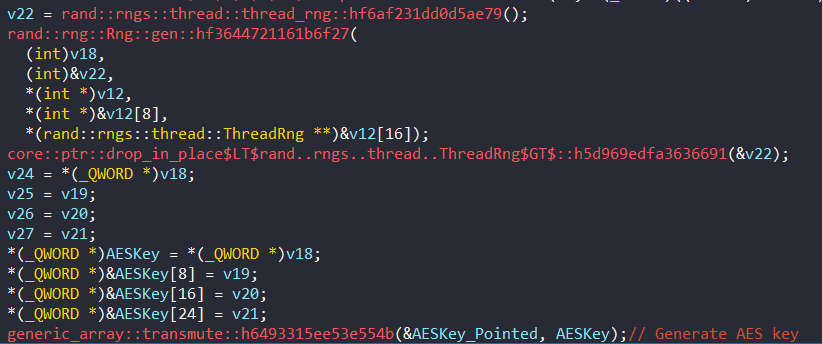

# Nuts And Bolts

## Solution
- This challenge gave me 2 file (1 ELF file written by Rust and source code of chall).
- It using AES Encryption in mode ECB (line 15-18) to generate random key with 32 bytes. Then It will reverse an array or XOR with key and enc_output (after encrypt input by AES).
- That check (rng.gen<u8>() % 2 == 0) will be decided to reverse an array of AES_Key, AES_enc_flag or XOR with AES_key or AES_enc_flag in 10 times loops.

  But in source code, we didn't know what value XORed with AESKey in XOR case, so we have to figure out in Rust binary.
  * First, tracing to `generic_array::transmute::h6493315ee53e554b()`, we'll get an AESKey.
  
  * After that, tracing to `nuts_and_bolts::StorageMethod$LT$_$GT$::xor::he5067cd565d835a0()`, we'll get an enc_AES_key.
  
  * Finally, XOR both AESKey and enc_AES_key, we'll get a xorkey. It must be 0xd value.
  
- When we got a keyxor, we can reverse this algo, here is my script solve .
  
